# OpenCTI on AWS — Core + Connector 詳細構成図

```mermaid
flowchart TB
    Admin["管理者端末<br/>AWS CLI + SSM Plugin"]
    Internet["インターネット<br/>Docker Hub / MITRE / CISA"]

    subgraph AWSCloud["AWS Cloud — us-west-1"]
        direction TB

        subgraph VPC["VPC 10.20.0.0/16"]
            direction TB
            IGW["Internet Gateway"]

            subgraph PublicSubnet["Public Subnet 10.20.0.0/24"]
                NAT["NAT Gateway + EIP"]
            end

            subgraph AppSubnet["Private App Subnet 10.20.10.0/24"]
                Relay["SSM Relay EC2<br/>t4g.micro / Inbound無し"]
                CloudMap["Cloud Map<br/>platform.opencti.local"]

                subgraph ECSCluster["ECS Cluster: opencti-cluster"]
                    Platform["Platform Task<br/>Fargate 2vCPU/16GB :4000"]
                    Worker["Worker Task ×2<br/>Fargate 1vCPU/2GB"]
                end
            end

            subgraph DataSubnet["Private Data Subnet 10.20.20.0/24"]
                OS["OpenSearch<br/>r7g.large.search / gp3 300GB"]
                Redis["ElastiCache Redis<br/>cache.r7g.large / noeviction"]
                MQ["Amazon MQ RabbitMQ<br/>mq.m7g.medium<br/>AMQPS:5671 / mgmt:443"]
            end

            S3EP["S3 Gateway Endpoint"]
        end

        S3Live["S3 Live Bucket"]
        S3Archive["S3 Archive Bucket"]

        SecretsCore["Secrets Manager（Core）<br/>Admin/暗号鍵/Health/Redis/RabbitMQ"]
        IAMCore["IAM（Core）<br/>ECSExecutionRole / OpenCTITaskRole"]
        LogsCore["CloudWatch Logs（Core）<br/>/ecs/opencti/platform, /worker"]

        subgraph ConnectorStack["Connectorスタック ×1〜5（opencti-connector.yaml）"]
            direction TB
            ConnTask["Connector Task<br/>Fargate 0.5vCPU/1GB ×1〜5"]
            SecretsConn["Secrets Manager<br/>Connector Token（個別）"]
            IAMConn["IAM<br/>ConnectorExecutionRole / ConnectorTaskRole"]
            LogsConn["CloudWatch Logs<br/>/ecs/opencti/connectors/*"]
        end
    end

    Admin -- "SSMポートフォワード :4000" --> Relay
    Relay -- ":4000" --> Platform
    Worker -- ":4000 GraphQL API" --> Platform
    ConnTask -- ":4000 GraphQL API" --> Platform

    Platform -- "SigV4 :443" --> OS
    Platform -- "TLS :6379" --> Redis
    Platform -- "AMQPS:5671 + mgmt:443" --> MQ
    Worker -- "AMQPS:5671" --> MQ
    ConnTask -- "AMQPS:5671" --> MQ

    Platform -- "S3 API" --> S3EP
    S3EP --> S3Live
    Worker -.-> S3Live
    ConnTask -. "s3:GetObject env file" .-> S3Live

    NAT --> IGW
    IGW --> Internet
    Platform -. "既定ルート" .-> NAT
    Worker -. "既定ルート" .-> NAT
    ConnTask -. "Feed取得" .-> NAT

    IAMCore -. "Secret注入" .-> SecretsCore
    IAMConn -. "Secret注入" .-> SecretsConn

    Platform --> LogsCore
    Worker --> LogsCore
    ConnTask --> LogsConn

    CloudMap -.-> Platform

    ConnTask -. "Fn::ImportValue<br/>Cluster/Subnet/SG/URL" .-> ECSCluster

    classDef compute fill:#3884ff22,stroke:#3884ffb0,stroke-width:1.2px,color:#1b2027
    classDef managed fill:#965af022,stroke:#965af0b0,stroke-width:1.2px,color:#1b2027
    classDef neutral fill:#eef1f4,stroke:#97a1ac,stroke-width:1px,color:#1b2027
    classDef connector fill:#3884ff22,stroke:#3884ffb0,stroke-width:1.6px,stroke-dasharray:5 3,color:#1b2027
    classDef actor fill:#eef1f4,stroke:#3884ffb0,stroke-width:1.2px,color:#1b2027

    class Admin,Internet actor
    class Relay,Platform,Worker,NAT,IGW compute
    class OS,Redis,MQ managed
    class CloudMap,S3EP,S3Live,S3Archive,SecretsCore,IAMCore,LogsCore neutral
    class ConnTask,SecretsConn,IAMConn,LogsConn connector
```

## 凡例

| 色 | 意味 |
|---|---|
| 青（実線） | Core スタックのコンピュート（EC2 / ECS） |
| 青（破線） | Connector スタックのリソース（`opencti-connector.yaml`、×1〜5） |
| 紫 | マネージド依存サービス（OpenSearch / Redis / Amazon MQ） |
| グレー | ネットワーク基盤・S3・Secrets Manager・IAM・CloudWatch Logs |

## 画像版

同内容のSVG画像は [`architecture.svg`](./architecture.svg) を参照してください。
